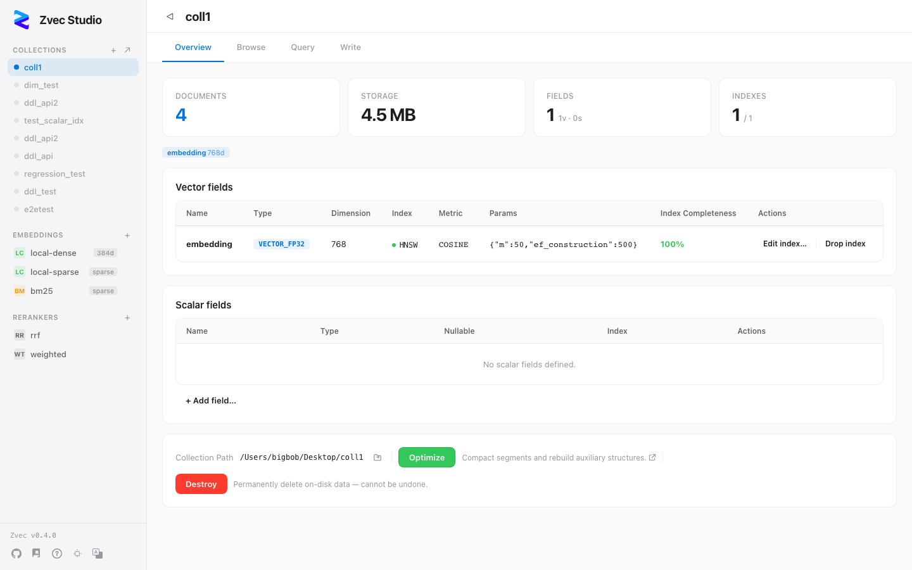

# Zvec Studio

**Visual management tool for the [Zvec](https://github.com/alibaba/zvec) embedded vector database** — browse data, test queries, and manage schemas without writing code.

[中文文档](README.zh-CN.md)

[](LICENSE)
[](CHANGELOG.md)



---

## Features

- **Collection Management** — Create, open, and delete collections with multi-vector fields. Each vector field can have its own index type (HNSW / IVF / FLAT / HNSW_RABITQ), metric, and quantization strategy.
- **Schema Evolution** — Add / drop / rename fields and create / drop vector indexes on the fly, without rebuilding the collection.
- **Data Browsing** — Filter documents with Zvec filter expressions, paginated browsing, JSON document details.
- **Document Operations** — Insert / Upsert / Update / Delete with batch JSON editing.
- **Vector Search** — Multi-vector ANN search with filter, TopK tuning, and search history.
- **AI-Powered Search** — Integrate embedding providers (OpenAI / Qwen / local models) for text-to-vector search; supports RRF / Weighted / Cross-Encoder reranking.
- **Bilingual UI** — Full Chinese & English interface with one-click language switching.
- **Desktop App** — Native macOS / Linux / Windows application, no Python required.

## Install

### Option 1: pip (recommended for developers)

```bash
pip install zvec-studio
zvec-studio
```

Opens http://127.0.0.1:7860 in your browser.

### Option 2: Desktop download

Grab the installer for your platform from [GitHub Releases](../../releases):

| Platform | Installer |
|----------|-----------|
| macOS (Apple Silicon) | `.dmg` |
| macOS (Intel) | `.dmg` |
| Linux | `.deb` / `.AppImage` |
| Windows | `.msi` / `.exe` |

Double-click to run — no Python needed.

### Option 3: From source (Web)

Prerequisites: **Node.js ≥ 18**, **pnpm ≥ 8**, **Python ≥ 3.10**

```bash
# 1. Clone
git clone https://github.com/zvec/zvec-studio.git
cd zvec-studio

# 2. Frontend dependencies
pnpm install

# 3. Backend virtual environment
cd apps/backend
python3 -m venv .venv
source .venv/bin/activate        # Windows: .venv\Scripts\activate
pip install -e ".[dev]"
cd ../..

# 4. Start both servers
make dev
```

This starts the backend on http://127.0.0.1:7860 and the frontend on http://127.0.0.1:5173.
Open **http://127.0.0.1:5173** in your browser.

> Without `make`, start manually in two terminals:
> ```bash
> # Terminal 1 — backend
> cd apps/backend && source .venv/bin/activate
> python -m uvicorn zvec_studio.main:app --host 127.0.0.1 --port 7860 --reload
>
> # Terminal 2 — frontend
> pnpm --filter frontend dev
> ```
>
> To stop: press `Ctrl+C`, or kill by port: `lsof -ti :7860 | xargs kill`

## Quick Start

**1. Create a collection** — Go to Collections → Create. Enter a name, path, and define your vector and scalar fields.

**2. Insert data** — Switch to the Write tab and paste JSON documents:

```json
[
  {"id": "a", "embedding": [0.1, 0.2, 0.3, 0.4], "title": "cat"},
  {"id": "b", "embedding": [0.9, 0.8, 0.7, 0.6], "title": "dog"}
]
```

**3. Vector search** — Switch to the Query tab, paste a query vector `[0.1, 0.2, 0.3, 0.4]`, set TopK, and hit Search.

**4. AI search** — Register an embedding model (e.g. OpenAI) in the sidebar, then search by typing text directly.

Full walkthrough: [Getting Started](docs/getting-started.md).

## Documentation

| Doc | Description |
|-----|-------------|
| [Getting Started](docs/getting-started.md) | 10-minute walkthrough from install to first vector search |
| [Product Overview](docs/overview.md) | Positioning, personas, feature roadmap, architecture |
| [Architecture](docs/architecture.md) | Request flow, module map, code index |
| [API Reference](docs/api.md) | REST endpoints, request/response formats, error codes |
| [Testing](docs/testing.md) | Test strategy, self-verification loop, performance baselines |
| [Packaging](docs/PACKAGING.md) | PyInstaller + Tauri packaging, cross-platform notes |
| [Contributing](CONTRIBUTING.md) | Dev setup, code style, commit workflow |
| [Changelog](CHANGELOG.md) | Release notes |

## Roadmap

| Version | Focus |
|---------|-------|
| **v0.1.x** (current) | Collection CRUD, schema evolution, document ops, vector search, AI extension, dark mode, i18n, desktop app |
| **v0.2.x** | Data import/export (CSV/JSON/JSONL), virtual scrolling, batch operations, advanced search |
| **v0.3.x** | Vector visualization (UMAP/t-SNE), clustering, AI Agent, SDK code generation |
| **v0.4.x** | VS Code extension, API Playground, webhooks & notifications |

## Contributing

Contributions welcome! See [CONTRIBUTING.md](CONTRIBUTING.md) for dev setup and commit workflow.

```bash
make dev        # Start dev servers
make verify     # Run all checks (lint + typecheck + tests)
```

## License

[Apache License 2.0](LICENSE)
