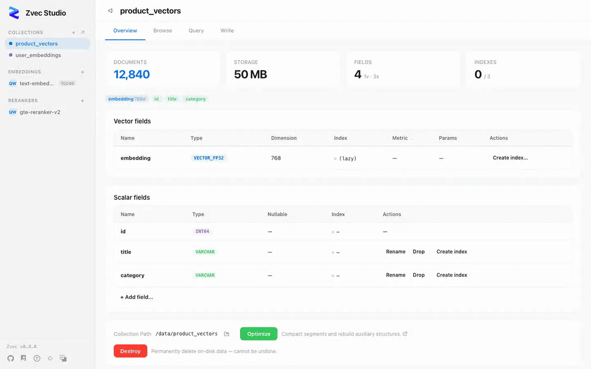

<p align="right">
  <a href="./README.md">English</a> | 中文
</p>

<p align="center">
  <picture>
    <source media="(prefers-color-scheme: dark)" srcset="docs/assets/hero-dark.svg" />
    
  </picture>
</p>

<p align="center">
  <strong><a href="https://github.com/alibaba/zvec">Zvec</a> 向量数据库可视化管理工具</strong><br/>
  不用写代码，直接浏览数据、测试查询、管理 Schema。
</p>

<p align="center">
  <a href="LICENSE"></a>
  <a href="https://pypi.org/project/zvec-studio/"></a>
  <a href="#"></a>
  <a href="https://github.com/zvec-ai/zvec-studio/actions/workflows/ci.yml"></a>
</p>

<p align="center">
  
</p>

---

## 📦 安装

### 方式一：pip 安装（开发者推荐）

```bash
pip install zvec-studio
zvec-studio
```

浏览器自动打开 http://127.0.0.1:7860。

### 方式二：桌面应用下载

从 [GitHub Releases](../../releases) 下载适合你平台的安装包：

| 平台 | 架构 | 安装包 |
|------|------|--------|
| macOS | Apple Silicon (arm64) | `.dmg` |
| Linux | x86_64, arm64 | `.deb` / `.AppImage` |
| Windows | x86_64 | `.msi` / `.exe` |

双击运行，无需安装 Python。

### 方式三：从源码运行

```bash
git clone https://github.com/zvec-ai/zvec-studio.git
cd zvec-studio
make install    # 安装 Node + Python 依赖
make dev        # 同时启动后端 + 前端开发服务器
```

> **需要本地调用 Embedding 模型？** 为了避免不必要的重依赖拖慢 CI，`make install`
> **不会**安装 AI 运行时依赖（`sentence-transformers` / `dashscope` 等）。
> 如果需要调用 `local-dense` / `bm25` 等内置函数的 `:embed` / `:rerank`，
> 改为执行 `make install.ai`。

> 环境要求：**Node.js ≥ 20**、**pnpm ≥ 9**、**Python ≥ 3.10**、**Rust**（桌面版需要）。
> 完整开发环境搭建见 [贡献指南](CONTRIBUTING.md)。

## ⚡ 快速上手

1. **创建集合** — 打开 Collections → Create，定义向量字段和标量字段。
2. **插入数据** — 在 Write 标签页粘贴 JSON 文档。
3. **向量搜索** — 在 Query 标签页粘贴查询向量，设置 TopK，点击搜索。
4. **AI 搜索** — 注册 Embedding 模型，直接输入文本搜索。

完整教程 → [快速上手指南](docs/getting-started.md)

## 📖 文档

| | |
|---|---|
| [快速上手](docs/getting-started.md) | 10 分钟从安装到第一次向量搜索 |
| [系统架构](docs/architecture.md) | 请求流程、模块结构、代码索引 |
| [API 参考](docs/api.md) | REST API 端点、请求 / 响应格式、错误码 |
| [测试指南](docs/testing.md) | 测试策略、自验证流程、性能基准 |
| [打包发布](docs/PACKAGING.md) | PyInstaller + Tauri 跨平台打包 |
| [贡献指南](CONTRIBUTING.md) | 开发环境搭建、代码规范、提交流程 |

## 🗺️ 路线图

| 版本 | 重点 |
|------|------|
| **v0.1.x**（当前） | 集合 CRUD、Schema 演进、文档操作、向量搜索、AI 扩展、中英文 i18n、桌面版 |
| **v0.2.x** | 数据导入导出、虚拟滚动、批量操作增强、高级搜索 |
| **v0.3.x** | 向量可视化（UMAP/t-SNE）、聚类分析、AI Agent、SDK 代码生成 |
| **v0.4.x** | VS Code 插件、API Playground、Webhook 与通知 |

## 🤝 参与贡献

欢迎贡献！请阅读 [CONTRIBUTING.md](CONTRIBUTING.md) 了解详情。

```bash
make dev        # 启动开发环境
make verify     # Lint + 类型检查 + 测试
```

## 📄 许可证

[Apache License 2.0](LICENSE)
